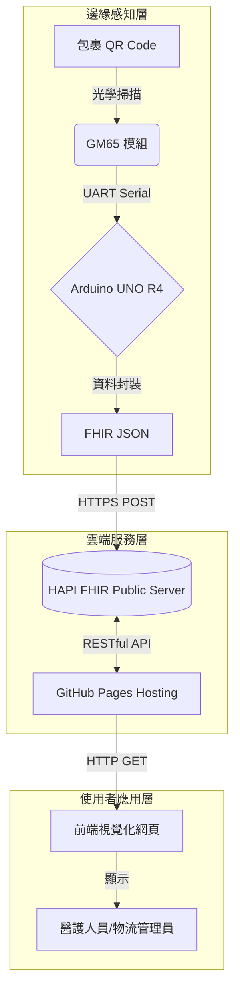

---
title: FHIR 醫療物資智慧追蹤系統 - 競賽專題報告
tags: FHIR, Arduino, IoT, MedicalInformatics
---

# FHIR 醫療物資智慧追蹤系統 - 競賽專題報告

**專題名稱**：基於 Arduino UNO R4 WiFi 與 FHIR 標準之醫療物流追蹤系統

**組別**：[哈哈]

**成員**：[施建宇]

**日期**：2025年12月10日

---

## 第一部分：系統規劃文件

### 1. 情境敘述（發生什麼事）
在現代化的大型醫療院所中，每天都有成千上萬的醫療物資在不同單位間流動（如高價藥品、手術器械包、血液檢體）。

目前的情況是：當一個急救藥品包裹從藥局出發後，直到送達護理站並人工通知之前，這段「運送中」的時間是完全的資訊黑洞。護理站不知道東西到哪了，傳送人員也只能用紙本或無法連網的設備紀錄，導致資訊斷層。

### 2. 情境目標（要解決什麼問題 / 為什麼要做）
我們希望解決醫院內部的「物流資訊孤島」問題。
我們的目標是：
- **標準化**：讓物流數據不再鎖死在封閉系統，而是變成符合 FHIR 國際標準的格式。
- **自動化**：利用 Arduino 與 QR Code 掃描器，取代人工抄寫。
- **即時化**：醫護人員能像查網購包裹一樣，隨時看到物資現在走到哪條走廊。

### 3. 需求分析（必備功能）
- **硬體端**：掃描器要能讀取包裹 QR Code，並發出聲音與燈光回饋（成功打勾、失敗打叉）。
- **連線端**：裝置要能連上 Wi-Fi，並透過 HTTPS 安全協定將資料傳出去。
- **資料端**：系統要能自動把掃描到的 ID 轉換成 FHIR `SupplyDelivery` 格式。
- **使用者端**：醫護人員不用裝 App，用瀏覽器就能看到物資的即時狀態與地點。

### 4. 工作流程（系統怎麼動）

**角色代入範例：急診室的緊急輸血調度**

1.  **發貨**：血庫備好血袋，貼上編碼 QR Code (`PKG-BLOOD-001`) 交給傳送員阿明。
2.  **運送中（掃描）**：
    *   阿明經過走廊的「物資掃描站」（本專案 Arduino 裝置）。
    *   阿明將血袋 QR Code 對準掃描器「嗶」一下。
    *   **系統動作**：Arduino 亮起綠色勾勾，並將 `Location` + `Time` 包裝成 FHIR JSON 上傳雲端。
3.  **即時監控**：
    *   急診護理師小美在電腦前，看到網頁上的血袋狀態跳轉為 **"In-Progress" (運送中)**。
    *   她確認血袋已在附近，減少焦慮與打電話催促的時間。
4.  **抵達**：阿明送達急診室，再次掃描確認 **"Completed" (已送達)**。

### 5. 使用角色（誰會使用系統）
- **傳送人員（物流）**：負責運送與掃描，不需要懂電腦，只要看到燈號亮起即可。
- **醫護人員（臨床）**：在護理站透過網頁查詢物資進度，安排醫療處置。
- **資訊人員（管理）**：透過標準 FHIR API 介接資料到醫院現有的 HIS 系統。

### 6. 主要 FHIR Resource
本系統核心僅使用最關鍵的資源，確保輕量化：

- **SupplyDelivery**: 核心資源。用來記錄物資配送的狀態（`status`）、識別碼（`identifier`）與發生時間（`occurrenceDateTime`）。
- **Location**: 輔助資源。用來標示掃描發生的地點（如 `Emergency Room`）。

---

## 第二部分：FHIR 基礎實作與成果

### 1. 系統架構圖
本系統採用物聯網三層架構，強調邊緣運算直接對接雲端標準伺服器。


### 2. 資料規格與 Resource Mapping
我們將物理世界的「掃描事件」映射為 FHIR 數位資源：

| 欄位名稱 | FHIR Path | 資料來源 | 範例值 |
| :--- | :--- | :--- | :--- |
| **資源類型** | `resourceType` | 固定值 | `"SupplyDelivery"` |
| **包裹編號** | `identifier[0].value` | **掃描器讀取 (動態)** | `"PKG-888"` |
| **運送狀態** | `status` | 程式邏輯判斷 | `"completed"` / `"in-progress"` |
| **掃描地點** | `destination.display` | Arduino 裝置設定 | `"Emergency Room Station"` |

### 3. 關鍵程式碼說明 (Arduino)
這是本專案最核心的技術突破：使用 Arduino 直接發送 HTTPS POST 請求給 HAPI FHIR Server。

*(完整程式碼請見文末 GitHub 連結)*

```
bool uploadToFHIR(String packageId) {
  // 使用 WiFiSSLClient 進行加密連線
  if (client.connect(serverAddress, serverPort)) {
    // 1. 手動組裝 FHIR JSON Payload
    String jsonPayload = "{";
    jsonPayload += "\"resourceType\": \"SupplyDelivery\",";
    jsonPayload += "\"status\": \"completed\",";
    jsonPayload += "\"identifier\": [{\"system\": \"http://my-hospital.org/tracking-id\", \"value\": \"" + packageId + "\"}],";
    jsonPayload += "\"destination\": {\"display\": \"Arduino Station\"}"; 
    jsonPayload += "}";

    // 2. 發送標準 HTTP POST 表頭
    client.println("POST /baseR4/SupplyDelivery HTTP/1.1");
    client.println("Host: " + String(serverAddress));
    client.println("Content-Type: application/json+fhir"); // 指定 FHIR 格式
    client.print("Content-Length: ");
    client.println(jsonPayload.length());
    client.println();
    client.println(jsonPayload);
    
    // ...處理回傳與錯誤檢查 (略)
    return true;
  }
  return false;
}
```

### 4. 實作成果展示

**硬體掃描實作：**

*圖說：整合了 GM65 掃描器與 Arduino UNO R4 的物資追蹤原型機。*

**前端查詢結果：**


*圖說：成功從 HAPI FHIR Server 撈取資料，並顯示於自製網頁上。*

### 5. 開發日誌與除錯紀錄
*(此處摘要開發過程中的關鍵技術挑戰)*

在開發過程中，最困難的點在於 **Arduino 與 HTTPS 的連線**。
1.  **問題**：一開始使用普通的 `WiFiClient`，永遠收到伺服器拒絕連線。
2.  **原因**：HAPI FHIR Server 強制要求 TLS/SSL 加密，一般 Arduino 函式庫不支援。
3.  **解決**：我們更換為最新的 Arduino UNO R4 WiFi，利用其 ESP32 模組內建的 `WiFiSSLClient`，並學會了如何處理憑證與加密連線，最終成功打通資料流。

**專案連結**
*   **GitHub Repository**: [GitHub 連結](https://github.com/Damonshih/fhir-package-tracker.git)
*   **Demo 網站**: [GitHub Pages 連結](https://damonshih.github.io/fhir-package-tracker/)

---

## 第三部分：學習歷程紀錄

### 1. FHIR 教學影片觀看紀錄

**觀看影片**：[AI 為什麼需要 FHIR？從資訊孤島到資料互通](https://www.youtube.com/watch?v=xbxYjA3RGV8)

**影片學習筆記截圖：**


>**學習重點筆記**：
>在觀看這部影片之前，我對於「資訊孤島」這個詞只有很模糊的概念。影片中提到醫院的 HIS、LIS、PACS 系統往往各自為政，就像講著不同語言的人，這讓我聯想到我們這次專題想解決的物流問題——藥局系統不知道護理站的情況。影片強調 FHIR 不僅僅是格式，更是一種「溝通的通用語言」，這讓我理解到我們使用 `SupplyDelivery` Resource 的意義，不只是為了交作業，而是為了讓這個物流資訊未來能被醫院裡任何一個 AI 或管理系統讀懂。

### 2. 與 AI 互動之使用說明


> **學習筆記**：
> 在觀看影片的過程中，我印象最深的是 FHIR 對於「互通性」的堅持。以前寫程式都是自己定義資料庫欄位，想怎麼開就怎麼開，但 FHIR 告訴我們，如果要跟別人溝通，就必須遵守同一套 Resource 定義。雖然一開始看 Resource 結構覺得很複雜（像洋蔥一樣一層包一層），但看懂之後發現這能解決很多系統對接的麻煩。

### 2. 與 AI 互動之使用說明

本專案在開發過程中，使用了 AI 工具（ChatGPT）來輔助程式除錯與概念釐清。

**互動截圖 1：詢問 HTTPS 連線問題**


**互動截圖 2：詢問 FHIR JSON 格式**


> **使用說明與驗證**：
> 我主要用 AI 來幫我檢查 C 語言的語法錯誤，以及請它提供 FHIR JSON 的範例格式。但我發現 AI 寫的 FHIR 格式有時候會是舊版（STU3）的，直接丟給 R4 Server 會報錯。所以我學會了不能全信 AI，必須要自己去官網查 Spec，確認欄位名稱是對的（例如 `occurrenceDateTime` 還是 `effectiveDateTime`），AI 是一個很好的助教，但不能當作標準答案。

### 3. 與導師諮詢會議記錄

**[專題延伸方向討論](https://hackmd.io/@8SqntYZfROaRXjgqLSj8Dg/BydT5c8zWx)**

### 4. 學習心得（Reflection）

身為一名剛進入醫資系的大一新生，這是我第一次接觸到「FHIR」這個看起來充滿英文縮寫與技術名詞的領域。說實話，剛開始報名的時候，我連 JSON 格式都還不太熟，只知道自己對寫程式和玩 Arduino 硬體有經驗也很有興趣。

在專題的一開始，我的想法很單純：不就是掃個 QR Code 嗎？應該很簡單吧？殊不知，「讓硬體說話」跟「讓硬體說 FHIR 標準的話」完全是兩回事。

最讓我崩潰的階段是在處理 Arduino 的聯網功能。我在學校宿舍用了好幾個晚上，明明掃描器都讀到資料了，但送給 Server 時卻一直失敗。那時候看著 Serial Monitor 一直跳出 "Connection Failed"，真的有種想放棄的衝動。後來透過瘋狂查資料和問 AI，才發現原來公開的 FHIR Server 需要 HTTPS 加密連線，而我原本用的函式庫太舊了。當我終於換上 `WiFiSSLClient`，並在半夜兩點看到 LED 矩陣亮起代表成功的「綠色勾勾」，同時網頁上跳出那筆資料的那一刻，那種成就感真的難以形容。

透過這次實作，我學到的不只是 C 語言或硬體接線，更重要的是理解了「標準」的價值。以前我覺得寫程式只要跑得動就好，但現在我知道，如果沒有 FHIR 這樣的標準，我的 Arduino 就只能是一個孤獨的玩具，無法跟醫院龐大的系統溝通。雖然我現在才大一，能做出來的功能還很陽春，但這個專案讓我看見了醫療資訊領域的廣大。未來的幾年，我希望能繼續加強我的程式能力，把這套系統做得更穩定，甚至加上身分驗證功能，真正解決醫療現場的問題。這次比賽對我來說，是一場從「寫作業」到「做產品」的珍貴啟蒙。

---